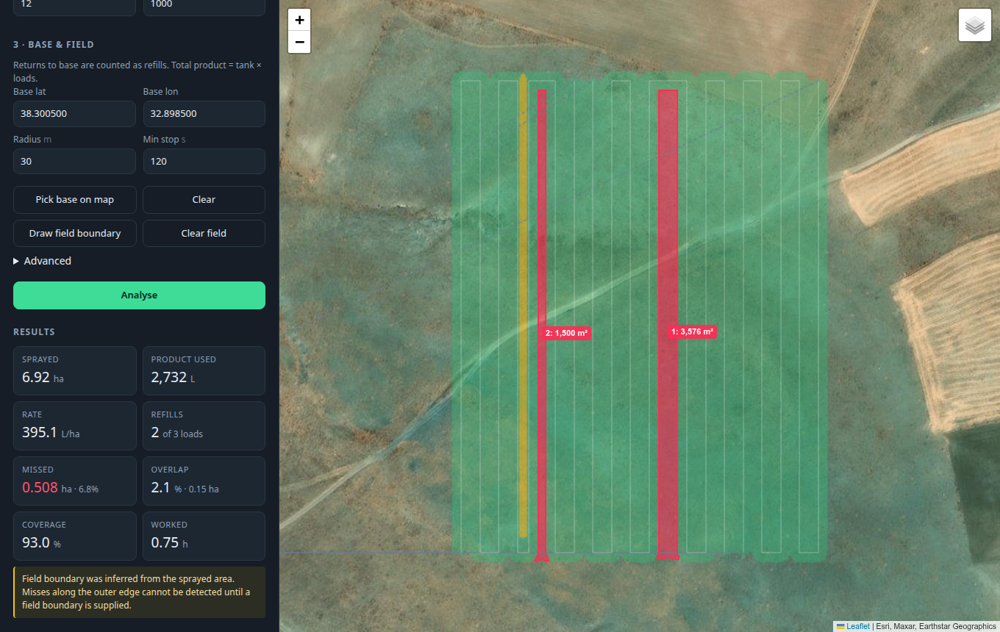

# Spraying Control

[![hacs][hacs-badge]][hacs-url]
[![license][license-badge]](LICENSE)

**See where you sprayed your garden — and where you missed.**

You walk your plot with a backpack sprayer and your phone in your pocket. This
turns that GPS track into a picture: which strips you covered, which you skipped,
which you went over twice, how much you used, and how many times you refilled.



---

## What it tells you

| | |
|---|---|
| **Coverage** | Area treated, and what fraction of the plot that is |
| **Missed strips** | Every unsprayed patch, with its size and where it is on the map |
| **Overlap** | Ground you went over twice or more |
| **Refills** | Each time you walked back to refill the backpack |
| **Product used** | Tank size × refills |
| **Rate** | Litres per hectare, per tankful and overall |

You enter your tank size, not a rate, so the rate is worked out from the ground
you actually covered. If one tankful comes out much heavier than another, that
usually means a lane got double-covered or a nozzle was off.

## Your garden, kept

A **garden** holds your settings, your refill point, your plot boundary, every
session you have walked and any aerial photos. Set it up once; after that a new
session is one file dropped on the window. Tick any set of sessions and analyse
them together.

## Your own aerial photo

Satellite basemaps top out around 0.3 m per pixel and often have nothing at all
at garden zoom — you end up staring at "map data not available". A picture from
a drone, a mast or a window upstairs is far sharper, so you can use your own:

1. Drop the image in alongside your tracks.
2. It is placed for you — from an ESRI world file (`.jgw`) if you have one,
   otherwise the camera's own GPS, otherwise the middle of your tracks.
3. Line it up. The quick way is **Pin two points**: click a feature you can
   recognise in the photo, then click where that feature really is — twice.
   Position, size and angle are worked out from the pair. By hand also works:
   drag the **white centre handle** to move it, the **rotate slider** to turn
   it, and type the real **width in metres**. The coloured corners fine-tune.
   **Save position** keeps it.
4. If you have walked the plot already, **Snap to my track** nudges the photo so
   your route lands on the paths and edges in it. The angle comes back
   reliably; scale is ambiguous where rows repeat, so if you know the real width
   type it in and tick **Keep the width**.

The photo sits under the coverage, and a slider fades the coverage back so you
can read the ground through it.

## Several sessions at once

Tick more than one session and they are analysed as one picture. Ground you
covered again in a later session shows as overlap, and each session reports how
much was **new** ground versus ground **already done** — which is what you want
when a plot gets a second treatment a fortnight later.

## Set your spray width first

The one number that matters most is **how wide a band you treat on one pass** —
your spray width. A single wide-angle nozzle covers roughly a metre; a narrow
directed nozzle less. Pick it with the preset buttons or type your own. Getting
it right is what makes the coverage and overlap numbers meaningful.

## A note on phone GPS

A phone is accurate to a few metres, and your spray band is about a metre wide.
So the **totals — area, refills, product used, rate — are reliable**, but the
fine map of exactly which centimetre got missed is a **guide, not a survey**.
The app tells you when your GPS is too coarse or logging too slowly to trust the
fine detail.

To get the sharpest map, turn on high-accuracy location while you spray. In the
Home Assistant Companion app: **Settings → Companion app → Manage sensors →
Location → High accuracy mode**, and set the update interval to a few seconds.
It uses more battery, so it is worth switching on only while you work — tie it to
a zone over your garden, or a helper you flip on.

Any track works: GPX, CSV, KML or GeoJSON from any app, as well as Home
Assistant history.

## Installing

Two independent pieces. Use either, or both.

| | **Integration** (HACS) | **Add-on** |
|---|---|---|
| Gives you | Sensors, history, a service to call | The map you see above |
| Setup | Point-and-click in the UI | Add-on configuration tab |
| Survives a restart | Yes | Sensors do not |

HACS distributes integrations, not add-ons, so the map lives in an add-on and
the sensors live in an integration.

> Needs amd64 or aarch64 Home Assistant. A 32-bit Raspberry Pi (armv7) is not
> supported, because the maths libraries have no 32-bit builds.

### The integration, via HACS

[![Open your Home Assistant instance and open a repository inside HACS.][hacs-repo-badge]][hacs-repo-url]

1. HACS → ⋮ → **Custom repositories** → this repository, category **Integration**
2. Download it, then restart Home Assistant
3. **Settings → Devices & services → Add integration → Spraying Control**
4. Pick the phone you carry, set your spray width and tank size, and drop the
   refill-point marker where you fill up

It reads the phone's location history and creates these on one device:

| Sensor | Unit | Extra detail (attributes) |
|---|---|---|
| `sensor.<name>_area_sprayed` | ha | |
| `sensor.<name>_volume_used` | L | each tankful |
| `sensor.<name>_application_rate` | L/ha | each tankful |
| `sensor.<name>_refills` | count | |
| `sensor.<name>_tank_loads` | count | |
| `sensor.<name>_coverage` | % | |
| `sensor.<name>_missed_area` | ha | the biggest missed patches, with coordinates |
| `sensor.<name>_overlap` | % | |
| `sensor.<name>_distance` | km | |
| `sensor.<name>_working_time` | h | |
| `sensor.<name>_last_run` | timestamp | the full summary |

Analyse a day whenever you like:

```yaml
action: spraying_control.analyze
data:
  date: "2026-08-11"      # optional, defaults to today
```

Or set **Analyse automatically at** in the options and it runs each evening for
the day just gone. For example, get a notification when you missed a patch:

```yaml
automation:
  - alias: Tell me if I missed a patch
    triggers:
      - trigger: state
        entity_id: sensor.garden_last_run
    conditions:
      - condition: numeric_state
        entity_id: sensor.garden_missed_area
        above: 0.005
    actions:
      - action: notify.mobile_app
        data:
          title: Missed a patch
          message: >-
            {{ state_attr('sensor.garden_missed_area', 'patch_count') }} spots
            left unsprayed.
```

### Record a session from your phone

The integration adds three controls to the device, so you can run a spray job
without touching a keyboard:

- **Set start point** (button) — stand where you refill and tap it; that spot
  becomes your refill/base point for the session.
- **Recording** (switch) — turn it on to start (it also switches your phone to
  high-accuracy GPS, if that option is on), walk and spray, turn it off to stop
  and analyse just that session.
- **Analyse today** (button) — if you forgot to record, analyse the whole day's
  track instead.

There's also a **Start point** sensor exposing the point's coordinates, so it
shows on a map card next to your phone, and a **Coverage map** image entity —
the pass-count picture (green once, yellow twice, orange three times, purple
four or more, red missed) for a picture card on the dashboard.

> Home Assistant's map card only plots points, so it can't draw the coverage
> overlay on a real satellite map. The **Coverage map** image shows the pattern;
> for the full interactive map (overlay on satellite tiles, gap outlines, the
> walked path) use the **add-on**.

#### Analyse a saved track file

Got a track from a handheld GPS or another app? **Settings → Devices &
services → Spraying Control → Configure → Analyse a track file** opens a file
picker — choose a GPX, CSV, KML or GeoJSON and the sensors update from it.

For automations, the `spraying_control.analyze_file` action analyses a file
already on the host (drop it into `/media` first):

```yaml
action: spraying_control.analyze_file
data:
  path: /media/spray.gpx
```

### A ready-made dashboard

[docs/dashboard.yaml](docs/dashboard.yaml) is a Lovelace **view** (a tab) that
mirrors the web interface — the record controls, a map, gauges and the results.
Add it by editing your dashboard → **+ (Add view)** → its ⋮ menu → **Edit in
YAML** → paste the whole file → Save. (Don't use *Raw configuration editor* —
that expects a whole dashboard and would replace your other tabs.) It assumes
the device is `Spraying · SM-A356E`; change `sm_a356e` throughout if your
tracker differs.

### The real map: satellite imagery, the overlay, gap outlines

The dashboard's **Coverage map** image (above) shows the sprayed pattern, but
not on satellite imagery — Home Assistant has nothing built in that can. For
the actual map — satellite tiles, the overlay geo-aligned on top, gap outlines,
your walked path, all pannable and zoomable — run the **web interface**. It's
the same thing this project's screenshot shows.

**On Home Assistant OS or Supervised:** install it as the **add-on** below —
it appears in your sidebar automatically.

**On Home Assistant Container / Core** (no Supervisor, so no Add-ons menu):
run it as its own container instead:

```bash
git clone https://github.com/cem-ayyildiz/spraying-control
cd spraying-control
cp .env.standalone.example .env
# edit .env: HA_URL=https://your-home-assistant, and a long-lived access
# token from your HA profile -> Security -> Long-Lived Access Tokens
docker compose -f docker-compose.standalone.yml up -d --build
```

Open `http://<that-host>:8099`. It talks to Home Assistant over the same REST
API the integration uses — reads tracker history, and its **Push to Home
Assistant** button writes `sensor.spray_*` states — just over the network
instead of through the Supervisor. There's no ingress, so put it behind your
own reverse proxy if you want a subdomain or TLS.

### The add-on, for the map (Home Assistant OS / Supervised only)

1. Copy this folder to `/addons/spraying_control/` on your HA host — via the
   Samba or File editor add-on, or `git clone` into that path
2. **Settings → Add-ons → Add-on store → ⋮ → Check for updates**
3. *Spraying Control* appears under **Local add-ons**. Install it
4. Set your spray width, tank size and refill point in **Configuration**
5. Start it and open it from the sidebar

It talks to Home Assistant through the Supervisor, so there is no token to set up
and no port to open. Its **Push to Home Assistant** button writes `sensor.spray_*`
values, but only until the next restart — for permanent sensors use the
integration.

## How it works out what you sprayed

There is no on/off signal in a GPS track, so it reads your movement:

| Question | How |
|---|---|
| Were you spraying? | Walking between your slowest and fastest spraying speed, away from the refill point |
| Where did it land? | A band your spray width along your path |
| Did you go over twice? | You came back to the same spot after enough time to be a second pass |
| Where is the plot? | Worked out from the sprayed area — or from a boundary you draw |
| Was that a refill? | You stopped at the refill point long enough, then carried on |

A couple of things follow from that: walking back to refill is not counted as
spraying (it is faster than a spraying pace), and stepping across to the next
lane may show as a little overlap at the ends. If you stop at the refill point at
the very end of the day it is treated as finishing up, not a refill, so the last
tankful is estimated from the area you covered rather than counted as a full
tank.

## Drawing your plot

Without a boundary, the plot is worked out from where you walked, which finds
anything you skipped *inside* it. To also catch a missed edge you never walked
to, draw the boundary on the map (**Draw plot boundary** → click the corners →
**Finish**) or supply a GeoJSON polygon.

## Without Home Assistant

```bash
uv sync                              # or: pip install -e .
uv run spraycontrol serve            # opens on :8099
```

```bash
# Analyse a saved track
uv run spraycontrol analyze walk.gpx \
    --swath 1.0 --tank 18 \
    --base 38.3005,32.8985 --base-radius 8 \
    --png coverage.png

# Several sessions in one picture, with a new-versus-repeat breakdown
uv run spraycontrol analyze april.gpx may.gpx june.gpx --base 38.3005,32.8985

# A demo walk with a skipped lane and an overlap built in
uv run spraycontrol demo
```

`spraycontrol analyze --help` lists every option.

Gardens are stored under `~/.local/share/spraycontrol/projects`, or wherever
`SPRAY_DATA_DIR` points. In the add-on and the standalone image that is `/data`,
which is a persistent volume.

As a library:

```python
from spraycontrol import analyze, parse_track, SprayerConfig, BaseLocation

track = parse_track(open("walk.gpx", "rb").read(), "walk.gpx")
result = analyze(
    track,
    SprayerConfig(swath_width_m=1.0, tank_capacity_l=18),
    BaseLocation(lat=38.3005, lon=32.8985, radius_m=8),
)
print(result.summary())
```

## Development

Everything runs on your machine — there is no cloud CI.

```bash
make install     # uv sync
make test        # analysis library tests
make test-ha     # Home Assistant integration tests (sets up .venv-ha on first run)
make validate    # everything: lint, both test suites, hassfest, add-on image build
make serve       # the web interface on :8099
make demo        # print a demo analysis
```

`make validate` is the whole check suite; run it before you push. It also works
as a git pre-push hook:

```bash
ln -s ../../scripts/validate.sh .git/hooks/pre-push
```

The tests build synthetic walks with defects of known size — a skipped lane, a
lane nudged into its neighbour — and check the reported figures match. The Home
Assistant tests use the pinned HA test harness, which needs a newer Python than
the library, so `make test-ha` gives them their own `.venv-ha`.

## Releasing

Versions live in three files (`pyproject.toml`, `config.yaml`, the integration
`manifest.json`) and are kept in sync by one command:

```bash
make release VERSION=0.3.0
# updates the three versions, stamps CHANGELOG.md, runs make validate,
# commits, tags v0.3.0, and offers to push and publish the GitHub Release.
```

HACS lists **GitHub Releases**, not bare tags, so publishing the Release (which
`make release` does) is what makes the update show up in Home Assistant. See
[CHANGELOG.md](CHANGELOG.md) for the history.

### Layout

The analysis library lives inside the integration folder, so HACS ships one
self-contained package and there is a single copy of the code. The add-on image
and the `spraycontrol` command both build from it.

```
custom_components/spraying_control/
  __init__.py       setup, analyze service, daily schedule
  config_flow.py    UI setup and options
  coordinator.py    location history -> analysis
  sensor.py         the eleven sensors
  spraycontrol/     the analysis library
    geo.py          local projection, no PROJ dependency
    parsers.py      GPX, CSV, KML, GeoJSON, Home Assistant history
    segment.py      walking vs paused vs refill, lanes, tank loads
    coverage.py     band rasterising, plot inference, gap finding
    analyze.py      putting it together, overlap counting, volume per tank
    report.py       map overlay, GeoJSON, text report
    web/            the map interface
config.yaml         add-on manifest
Dockerfile          add-on image
hacs.json           HACS metadata
```

## License

MIT — see [LICENSE](LICENSE).

[hacs-badge]: https://img.shields.io/badge/HACS-Custom-41BDF5.svg
[hacs-url]: https://hacs.xyz
[license-badge]: https://img.shields.io/badge/license-MIT-blue.svg
[hacs-repo-badge]: https://my.home-assistant.io/badges/hacs_repository.svg
[hacs-repo-url]: https://my.home-assistant.io/redirect/hacs_repository/?owner=cem-ayyildiz&repository=spraying-control&category=integration
